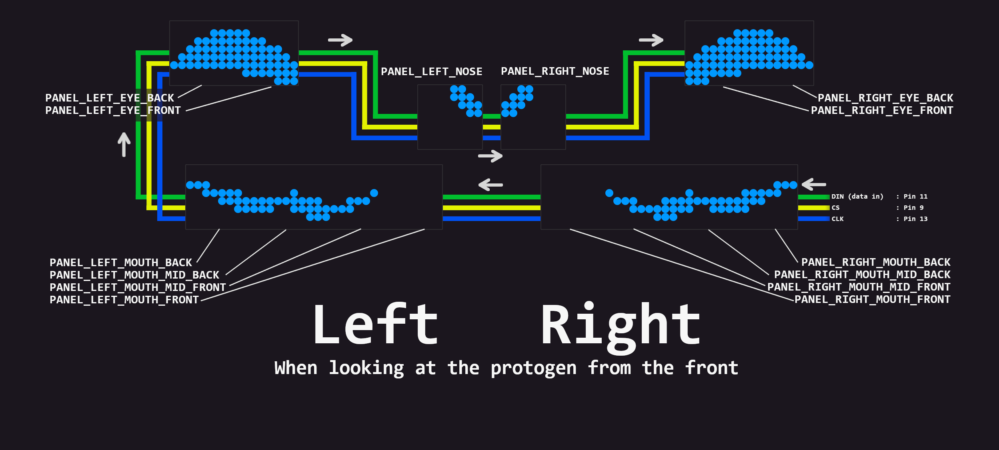
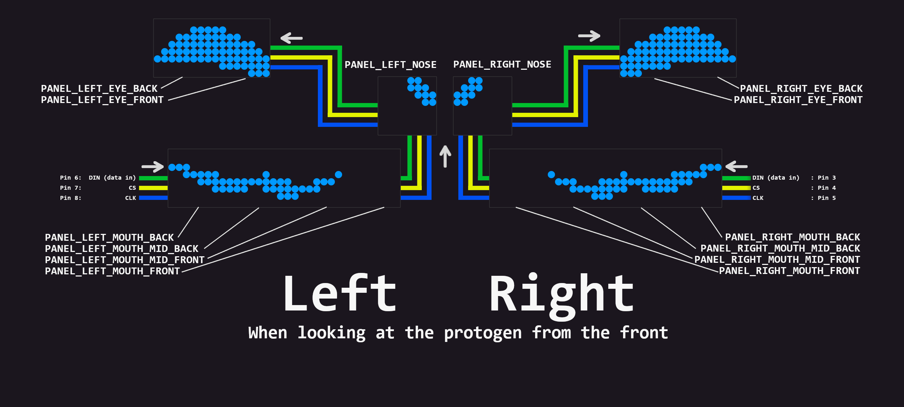

# Protosoft Toaster OS

Software to control Arduino-based protogen heads, using 8x8 MAX7219 LED matrices.


<br><br>

# Features

- Controls a protogen head using 8x8 LED matrices to render eyes, nose & mouth on each side of a face
- Supports light strips in each ear/headphones
- Nose "boop" detection & animation
- Blinking animations
- Different expressions, with simple animations

<br><br>

# Setup

## Dependencies

- [FastLED](https://fastled.io/) (not included; installed via Arduino IDE)
- [LedControl](https://github.com/wayoda/LedControl) (included)

<br>

## Electronics

- For both sides of the face
   - Mouth: 4 x MAX7219 8x8 LED martices
   - Eyes: 2 x MAX7219 8x8 LED martices
   - Nose: 1 x MAX7219 8x8 LED martices
- For both sides of the head
   - A strip of 15 RGB LEDs (5V, 3-pin)
- Boop sensor
   - A 3-pin 5V IR proximity distance sensor
- A 5V Noctua fan (40x40x10mm) for ventilation (not connected to the arduino)
- A USB cable and voltage + ground splitters to power everything via a USB battery pack

<br>

## Configuring

The configuration can be found in `ToasterOS/Config.h` <br>
This file includes configuration for the face LEDs, the side lights, boop sensor and more.

There are some examples below for different setups.

<br>

### Example: Single connection for all LED panels



```cpp
FaceConfig::FaceConfig() {
  NumConnections = 1;

  Connections = new FaceLEDConnection[NumConnections]{
    {
      // Pin configuration
      .PIN_DataIn = 11,
      .PIN_CS = 9,
      .PIN_CLK = 13,

      // Define the order of the panels
      .NumPanels = 14,
      .Panels = {
        // Start: Right mouth back
        { .PanelType = PANEL_RIGHT_MOUTH_BACK, .FlipX = false, .FlipY = false },
        { .PanelType = PANEL_RIGHT_MOUTH_MID_BACK, .FlipX = false, .FlipY = false },
        { .PanelType = PANEL_RIGHT_MOUTH_MID_FRONT, .FlipX = false, .FlipY = false },
        { .PanelType = PANEL_RIGHT_MOUTH_FRONT, .FlipX = false, .FlipY = false },

        // -> Left mouth front
        { .PanelType = PANEL_LEFT_MOUTH_FRONT, .FlipX = false, .FlipY = false },
        { .PanelType = PANEL_LEFT_MOUTH_MID_FRONT, .FlipX = false, .FlipY = false },
        { .PanelType = PANEL_LEFT_MOUTH_MID_BACK, .FlipX = false, .FlipY = false },
        { .PanelType = PANEL_LEFT_MOUTH_BACK, .FlipX = false, .FlipY = false },

        // -> Left eye back
        { .PanelType = PANEL_LEFT_EYE_BACK, .FlipX = false, .FlipY = false },
        { .PanelType = PANEL_LEFT_EYE_FRONT, .FlipX = false, .FlipY = false },

        // -> Left nose
        { .PanelType = PANEL_LEFT_NOSE, .FlipX = false, .FlipY = false },

        // -> Right nose
        { .PanelType = PANEL_RIGHT_NOSE, .FlipX = false, .FlipY = false },

        // -> Right eye front
        { .PanelType = PANEL_RIGHT_EYE_FRONT, .FlipX = false, .FlipY = false },
        { .PanelType = PANEL_RIGHT_EYE_BACK, .FlipX = false, .FlipY = false },
      },
    }
  };
}
```

<br><br><br>

### Example: Separate left and right side connections




```cpp
FaceConfig::FaceConfig() {
  NumConnections = 2;

  Connections = new FaceLEDConnection[NumConnections]{
    // Right half of the face
    {
      // Pin configuration
      .PIN_DataIn = 3,
      .PIN_CS = 4,
      .PIN_CLK = 5,

      // Define the order of the panels
      .NumPanels = 7,
      .Panels = new PanelConfig[7]{
        // Start: mouth back
        { .PanelType = PANEL_RIGHT_MOUTH_BACK, .FlipX = false, .FlipY = false },
        { .PanelType = PANEL_RIGHT_MOUTH_MID_BACK, .FlipX = false, .FlipY = false },
        { .PanelType = PANEL_RIGHT_MOUTH_MID_FRONT, .FlipX = false, .FlipY = false },
        { .PanelType = PANEL_RIGHT_MOUTH_FRONT, .FlipX = false, .FlipY = false },
        // -> nose
        { .PanelType = PANEL_RIGHT_NOSE, .FlipX = true, .FlipY = true },
        // -> eye front
        { .PanelType = PANEL_RIGHT_EYE_FRONT, .FlipX = true, .FlipY = true },
        { .PanelType = PANEL_RIGHT_EYE_BACK, .FlipX = true, .FlipY = true },
      },
    },
    // Left half of the face
    {
      // Pin configuration
      .PIN_DataIn = 6,
      .PIN_CS = 7,
      .PIN_CLK = 8,

      // Define the order of the panels
      .NumPanels = 7,
      .Panels = new PanelConfig[7]{
        // Start: mouth back
        { .PanelType = PANEL_LEFT_MOUTH_BACK, .FlipX = true, .FlipY = true },
        { .PanelType = PANEL_LEFT_MOUTH_MID_BACK, .FlipX = true, .FlipY = true },
        { .PanelType = PANEL_LEFT_MOUTH_MID_FRONT, .FlipX = true, .FlipY = true },
        { .PanelType = PANEL_LEFT_MOUTH_FRONT, .FlipX = true, .FlipY = true },
        // -> nose
        { .PanelType = PANEL_LEFT_NOSE, .FlipX = false, .FlipY = false },
        // -> eye front
        { .PanelType = PANEL_LEFT_EYE_FRONT, .FlipX = false, .FlipY = false },
        { .PanelType = PANEL_LEFT_EYE_BACK, .FlipX = false, .FlipY = false },
      },
    }
  };
}
```

<br><br><br>


### Example Single connection, single nose panel, shorter mouth panels
```cpp
FaceConfig::FaceConfig() {
  // Separate left and right connection
  NumConnections = 1;

  Connections = new FaceLEDConnection[NumConnections]{
    {
      // Pin configuration
      .PIN_DataIn = 12,
      .PIN_CS = 11,
      .PIN_CLK = 10,

      // Define the order of the panels
      .NumPanels = 11,
      .Panels = new PanelConfig[11]{
        // Start Right eye back
        { .PanelType = PANEL_RIGHT_EYE_BACK, .FlipX = false, .FlipY = true },
        { .PanelType = PANEL_RIGHT_EYE_FRONT, .FlipX = false, .FlipY = true },

        // -> Right mouth back
        { .PanelType = PANEL_RIGHT_MOUTH_BACK, .FlipX = false, .FlipY = true },
        { .PanelType = PANEL_RIGHT_MOUTH_MID_BACK, .FlipX = false, .FlipY = true },
        { .PanelType = PANEL_RIGHT_MOUTH_MID_FRONT, .FlipX = false, .FlipY = true },

        // -> Nose
        { .PanelType = PANEL_SINGLE_NOSE, .FlipX = false, .FlipY = true },

        // -> Left mouth front
        { .PanelType = PANEL_LEFT_MOUTH_MID_FRONT, .FlipX = false, .FlipY = true },
        { .PanelType = PANEL_LEFT_MOUTH_MID_BACK, .FlipX = false, .FlipY = true },
        { .PanelType = PANEL_LEFT_MOUTH_BACK, .FlipX = false, .FlipY = true },

        // // -> Left eye back
        { .PanelType = PANEL_LEFT_EYE_FRONT, .FlipX = false, .FlipY = true },
        { .PanelType = PANEL_LEFT_EYE_BACK, .FlipX = false, .FlipY = true },

        // Example empty panel
        // { .PanelType = -1, .FlipX = false, .FlipY = false },
      },
    }
  };
}
```

<br>

### Debugging issues with the face config

If the face isn't rendering properly, there are some steps you can take

1. In `ToasterOS/Config.h`, set `DEBUG_MODE` to 3
    - This will render 7s to every LED panel
2. If one of the panels is displaying the 7 the wrong way or upside down, update the config
    - In `ToasterOS/Config.h` under `FaceConfig`
    - Find the right panel (see the diagrams above)
    - If the 7 is facing the wrong way, change the `FlipX` value
    - If the 7 is upside down, change the `FlipY` value
3. In `ToasterOS/Config.h`, set `DEBUG_MODE` back to 0
4. If the face still looks wrong, check that you have added the panels to the config in the right order
    - They should be added in the same order they are wired

<br><br><br>

# Creating new faces

1. Open the file `face-demo.html` in your browser
2. Draw your new face
3. Add it to the code
    - `ToasterOS/Protogen_Faces.h`
    - Add in your `FaceExpression` struct
    - Give it a good variable name
    - Increase the variable `NumSpecialFaces` by 1
    - Add `&YourVariableName` to the `SpecialExpressions` array (see others for examples)

<br><br>

# Arduino Basics

- [Docs](https://docs.arduino.cc/learn/starting-guide/getting-started-arduino#a-typical-workflow)
- [Arduino IDE 2](https://docs.arduino.cc/software/ide-v2)
- [Example projects](https://github.com/BadgerCode/Arduino-Test-Projects)

## Nano Every Pin out


